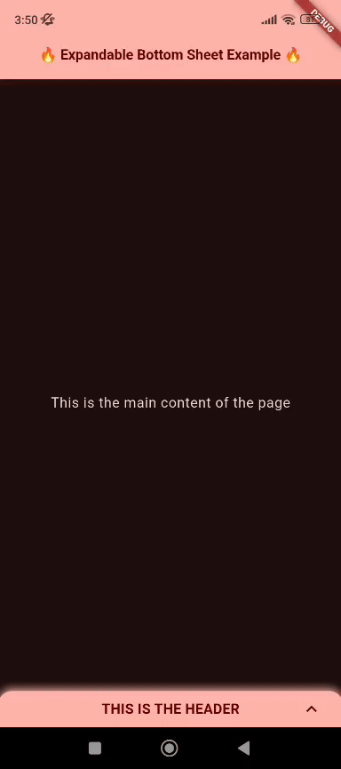

<h1 align="center">🔥 Fire Widget's 🔥</h1>

A collection of custom widgets for Flutter.

## Features

- ExpandableBottomSheetPage: A full page widget with body and an expandable bottom menu;
- ThemeColorsViewerPage: A page to visualize all the theme colors.

<h1 align="center">WIDGETS</h1>

## ThemeColorsViewerPage

This widget is a full page to visualize in runtime all the theme schema colors, simple use it as a full page and modify the ThemeData properties. For a full example see the /example/lib/theme_colors_viewer_page_example.dart in Example tab.

  

## ExpandableBottomSheetPage

This widget is a full page widget, that consists in a page body and a bottom sheet menu with header and a body. For a full example see the /example/lib/expandable_bottom_sheet_page_example.dart in Example tab.

  

