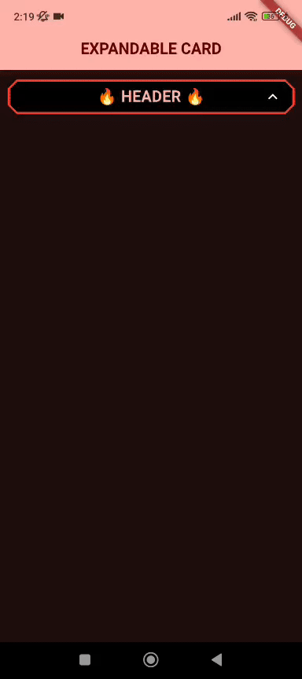
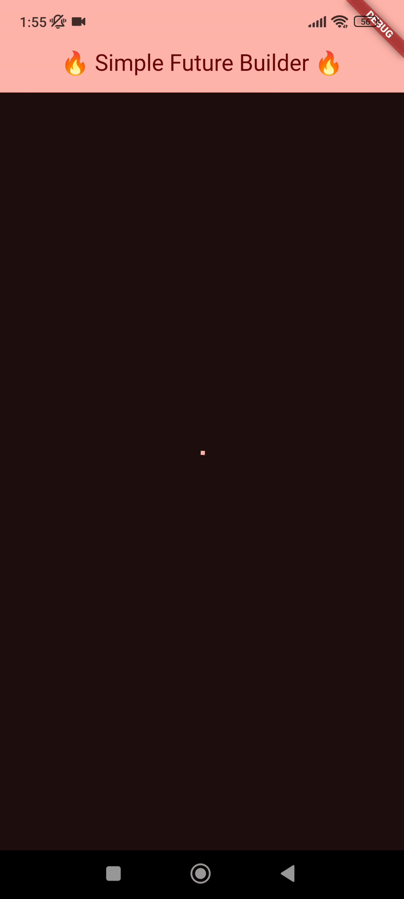

<h1 align="center">🔥 Fire Widget's 🔥</h1>

A collection of custom widgets for Flutter.

## Features

- ExpandableBottomSheetPage: A full page widget with body and an expandable bottom menu;
- ThemeColorsViewerPage: A page to visualize all the theme colors.

<h1 align="center">WIDGETS</h1>

## ThemeColorsViewerPage

| **Description** | **Preview** |
|-----------------|------------|
| This widget is a full page to visualize all theme colors. You can modify the `ThemeData` properties to see changes in real-time. It's great for debugging and understanding how colors pallet are generated and chose how you gonna use across the app. |  |

## ExpandableBottomSheetPage

| **Description** | **Preview** |
|-----------------|------------|
| This widget combines a page body with a bottom sheet that expands or collapses with a header and body. It’s perfect for creating pages with expandable menus or extra content. |  |

## ExpandableCard

| **Description** | **Preview** |
|-----------------|------------|
| This widget is a separate card into header and body, you can fully customize both separately, the header is always visible and the body is expanded and collapsed when you click on the header. |  |

## SimpleFutureBuilder

| **Description** | **Preview** |
|-----------------|------------|
| This widget simplify the native future builder, it checks the current loading status and place widgets accordingly. |  |

***
- For more info see [pub.dev](https://pub.dev/packages/fire_widgets);
- For a full usage examples see [examples](https://pub.dev/packages/fire_widgets/example).

- 

